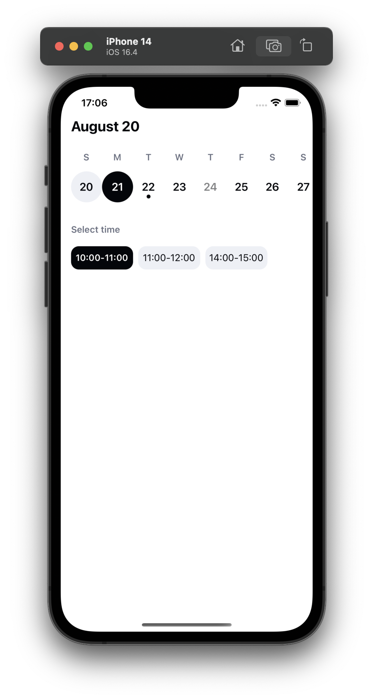
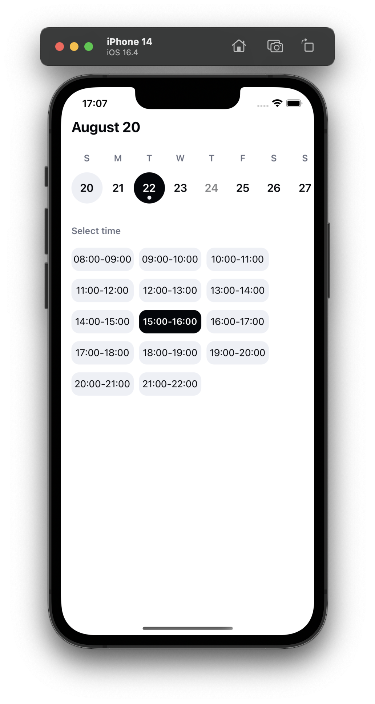
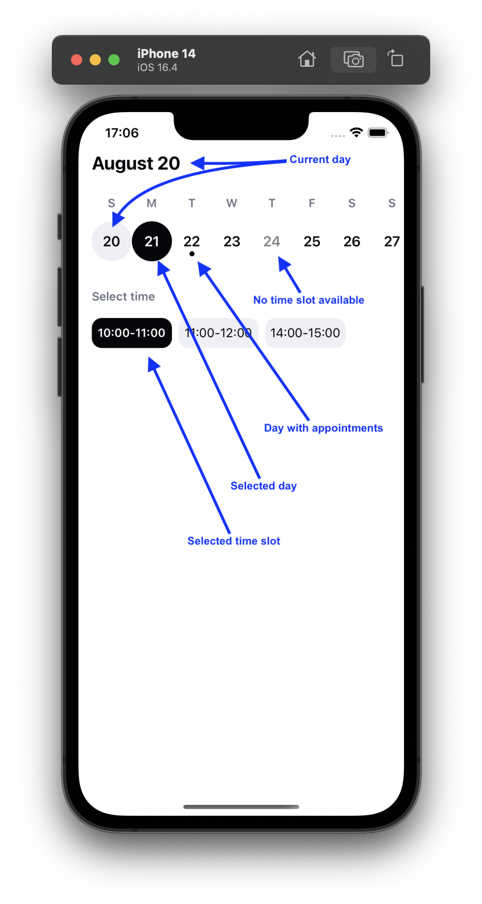
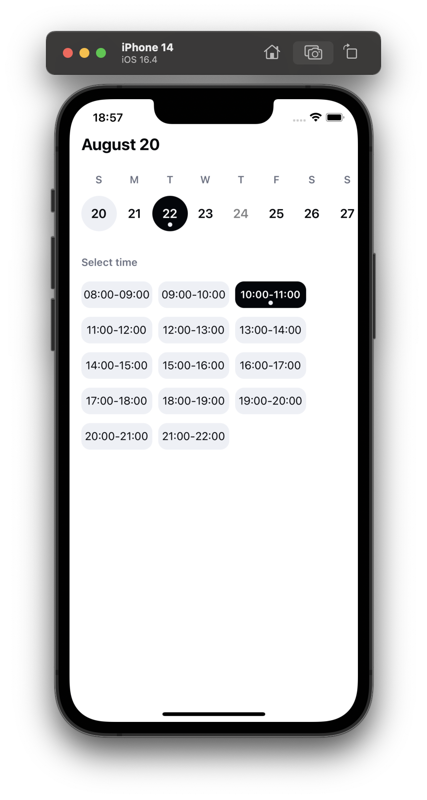
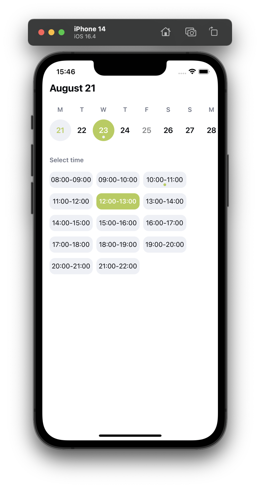

# react-native-time-slot-picker

[![NPM version][npm-image]][npm-url] [![npm][npm-downloads]][npm-url] [![npm][license-url]][npm-url] [![npm][types-url]][npm-url] [![runs with expo][expo-image]][expo-url]

## Features

- No dependencies.
- A time slot picker for react native.
- Pass the `availableDates` you want to show.
- Pick a day and the timeslot you wish.
- Simple UX.
- Use colors of your preference by using the params.
- Use day shortnames and month names of your preference by using the params.
- Change the title of the timeslots section by using the params.
- Change the width of timeslot element by using the params.

## Table of contents

- [Changelog](CHANGELOG.md)
- [Screenshots](#screenshots)
- [Installation](#installation)
- [Usage](#usage)
- [Props](#props)
- [Interfaces](#interfaces)

## Screenshots

[](example/screenshots/1.png)
[](example/screenshots/2.png)
[](example/screenshots/3.png)
[](example/screenshots/4.png)
[](example/screenshots/5.png)

> You can test the library by opening the following snack [here](https://snack.expo.dev/@dgreasi/react-native-time-slot-picker).

## Run example locally

```shell
git clone https://github.com/dgreasi/react-native-time-slot-picker.git
cd react-native-time-slot-picker
npm i # or `yarn`
npm run example ios # or `yarn example ios`
```

## Installation

```sh
npm i @dgreasi/react-native-time-slot-picker
# OR
yarn add @dgreasi/react-native-time-slot-picker
```

## Usage

```tsx
import * as React from 'react';
import { SafeAreaView, StatusBar } from 'react-native';
import {
  IAppointment,
  IAvailableDates,
  TimeSlotPicker,
} from '@dgreasi/react-native-time-slot-picker';
import { useEffect, useState } from 'react';

const availableDates: IAvailableDates[] = [
  {
    date: '2023-08-17T21:00:00.000Z', // new Date().toISOString()
    slotTimes: ['08:00-09:00', '09:00-10:00'], // Array<string> of time slots
  },
  {
    date: '2023-08-18T21:00:00.000Z',
    slotTimes: [], // No availability
  },
  {
    date: '2023-08-19T21:00:00.000Z',
    slotTimes: ['08:00-09:00', '09:00-10:00'],
  },
];

export default function App() {
  const [scheduledAppointments, setScheduledAppointments] =
    useState<IAppointment[]>([]);

  useEffect(() => {
    // Contains the selected date, time slot in the following format
    // {"appointmentDate": "2023-08-17T21:00:00.000Z", "appointmentTime": "18:00-19:00"}
    console.log('Date of appointment updated: ', dateOfAppointment);
  }, [dateOfAppointment]);

  return (
    <SafeAreaView>
      <StatusBar backgroundColor="transparent" barStyle="dark-content" />
      <TimeSlotPicker
        scheduledAppointments={scheduledAppointments}
        setScheduledAppointments={setScheduledAppointments}
        availableDates={dummyAvailableDates}
      />
    </SafeAreaView>
  );
}
```

You can find a detailed example [here](example/src/App.tsx).

## Props

| Prop name                   | Description                                                                                                                 | Type                                   | Default                                                                                                                      |
| --------------------------- | --------------------------------------------------------------------------------------------------------------------------- | -------------------------------------- | ---------------------------------------------------------------------------------------------------------------------------- |
| `availableDates`            | The array of the available slot times per date.                                                                             | `IAvailableDates[]`                    | [fixedAvailableDates](src/utils/dateHelpers.ts)                                                                              |
| `scheduledAppointments`      | An already existing array of appointments, which is going to mark the specific dates as `with appointment`.                             | `IAppointment[]`                         | `[]`
| `setScheduledAppointments`      | Callback called when the user selects or deselects a time slot. It contains all currently selected time slots. | `(data: IAppointment[]) => void` | **REQUIRED**                                                                                                                 |
| `multipleSelection`      | Enables the selection of multiple slots. | `boolean` | `false`                                                                                                                 |                                          |
| `multipleSelectionStrategy`      | Strategy used to restrict selection and deselection.  | `"consecutive" \| "same-day-consecutive" \| "non-consecutive"` | `non-consecutive` |                                          |
| `marginTop`                 | Margin top for the whole component.                                                                                         | `number`                               | `0`                                                                                                                          |
| `datePickerBackgroundColor` | Background color of the section with the horizontal scroll, which contains the days.                                        | `hex string`                           | `'#FFFFFF'`                                                                                                                  |
| `timeSlotsBackgroundColor`  | Background color of the section that contains the time slots.                                                               | `hex string`                           | `'#FFFFFF'`                                                                                                                  |
| `timeSlotsTitle`            | Title of section that contains the                                                                                          | `string`                               | `'Select time'`                                                                                                              |
| `mainColor`                 | Main color of the time slot picker                                                                                          | `hex string`                           | `'#04060A'`                                                                                                                  |
| `timeSlotWidth`             | Time slot pill width                                                                                                        | `number`                               | `96`                                                                                                                         |
| `dayNamesOverride`          | Day string array to override letters for each Calendar day. First day is Sunday.                                            | `string[]`                             | `['S', 'M', 'T', 'W', 'T', 'F', 'S']`                                                                                        |
| `monthNamesOverride`        | Month string array to override default month names that are used as title.                                                  | `string[]`                             | `['January', 'February', 'March', 'April', 'May', 'June', 'July', 'August', 'September', 'October', 'November', 'December']` |

## Interfaces

| Name              | Description                                            |
| ----------------- | ------------------------------------------------------ |
| `IAvailableDates` | `{ date: string, slotTimes: string[] }`                |
| `IAppointment`    | `{ appointmentDate: string, appointmentTime: string }` |

## Roadmap

- Update `scheduledAppointment` arg to accept multiple appointments.
- Update logic of getAppointmentDay() to show dot in dates.
- Merge providers for performance improvement.

## License

MIT

[npm-url]: https://www.npmjs.com/package/@dgreasi/react-native-time-slot-picker
[npm-image]: https://img.shields.io/npm/v/@dgreasi/react-native-time-slot-picker?style=flat-square
[license-url]: https://img.shields.io/npm/l/@dgreasi/react-native-time-slot-picker?style=flat-square
[types-url]: https://img.shields.io/badge/types-included-blue?style=flat-square
[expo-image]: https://img.shields.io/badge/Runs%20with%20Expo-4630EB.svg?style=flat-square&logo=EXPO&labelColor=f3f3f3&logoColor=000
[expo-url]: https://snack.expo.dev/@dgreasi/react-native-time-slot-picker
[npm-downloads]: https://img.shields.io/npm/dm/@dgreasi/react-native-time-slot-picker?style=flat-square
